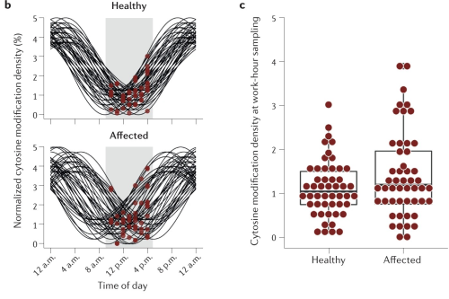
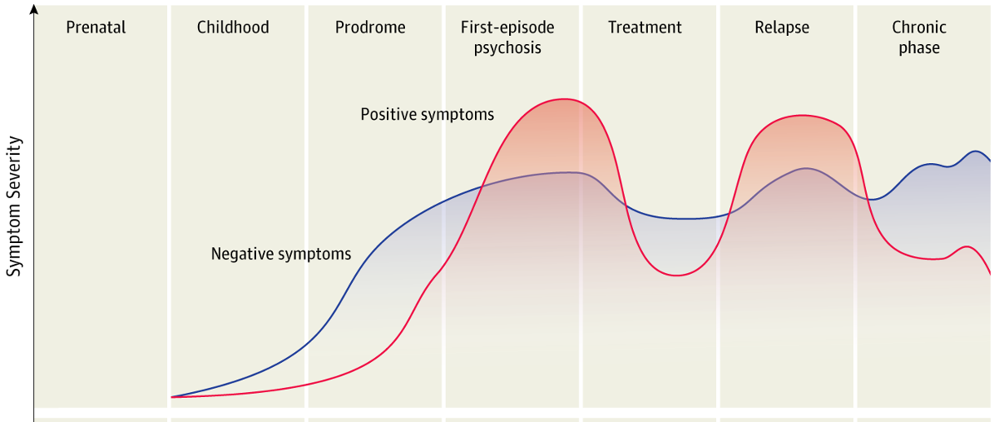
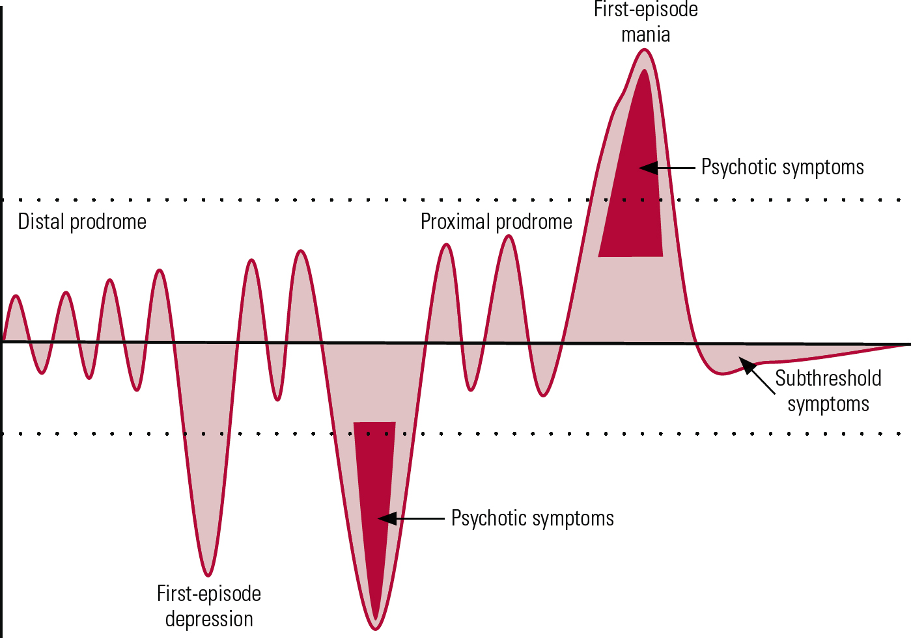

```{r setup, include=FALSE}
options(htmltools.dir.version = FALSE)
knitr::opts_chunk$set(
  fig.width=9, fig.height=3.5, fig.retina=3,
  out.width = "100%",
  cache = FALSE,
  echo = TRUE,
  message = FALSE, 
  warning = FALSE,
  hiline = TRUE
)
library(fontawesome)
library(tidyverse)
library(xaringan)
library(here)

```

```{r xaringan-themer, include=FALSE, warning=FALSE}
library(xaringanthemer)

dark_yellow <- "#EFBE43"
light_yellow <- "#FDF7E9"
gray <- "#333333"
blue <- "#4466B0"

style_duo(
  # colors
  primary_color = light_yellow,
  secondary_color = dark_yellow,
  header_color = gray,
  text_color = gray,
  code_inline_color = colorspace::lighten(gray),
  text_bold_color = colorspace::lighten(gray),
  link_color = blue,
  title_slide_text_color = blue,

  # fonts
  header_font_google = google_font("Martel", "300", "400"),
  text_font_google = google_font("Lato"),
  code_font_google = google_font("Fira Mono")  
)


```

```{r xaringanExtra, echo=FALSE, warning=FALSE}

library(xaringanExtra)
xaringanExtra::use_logo("slides/UiBlogoMED_gray_v_Eng.png",
                        width = "250px",
                        height = "250px",
                        position = xaringanExtra::css_position(top = "2em", right = "2em"))
                     

xaringanExtra::use_tile_view()

```


```{css extra.css, echo=FALSE}

.small { 
  font-size: 0.75em
}  

.bitty { 
    font-size: 1.25em;
}

.enlarge { 
    font-size: 1.5em;
}

.fade {
  opacity: 0.66;
}

```


---

class:hide_logo

###**An Epigenetic Study of Treatment Effects and Environmental Factors in Schizophrenia and Bipolar Disorder**<br><br>

.large[.right[
**Principal Supervisor**: Stéphanie Le Hellard, UiB<br><br>
**Co-Supervisors**: Anne-Kristin Stavrum, UiB,<br><br>
                  Tetyana Zayats, Broad Institute, USA<br><br>
                  Ingrid Melle, UiO<br><br><br>
                  July 1, 2019 - June 30, 2023
]]              

---

###Financing for this PhD project: <br> <br />

.bitty[
  - UiB as a contribution to NORMENT CoE (NFR 213363) <br> <br>
  - BEDREHELSE grant: "DNA methylation in psychiatric disorders, and mediation of gene by environment effects, from birth to adulthood." (NFR 273446) <br> <br>
 - REK approval (#2009/2485, #2013/1727)
] 
---

###Plan for this talk <br> <br />
###- Objectives <br />
###- Methods <br />
###- Status of project <br />


---

background-image: url(slides/ECT3.png)
background-position: 50% 65%
background-size: 650px

class: left top 
###Formal training components completed

---

background-image: url(slides/posters3.png)
background-position: contain
background-size: 800px


class: left top 
###FORMIDL901 to be completed

---

background-image: url(slides/Plan3.png)
background-position: 50% 65%
background-size: 675px

class: left top 
###Plan for project completion

---

###Technical / Scientific / Personal Challenges <br> <br>

.bitty[
- Prior to COVID-19 lockdown, NORMENT projects were moved to a secure platform (TSD). <br> <br>
 - Months of delays occurred when upgrades were made to the servers and our data was moved to the new servers. <br> <br> 
 - We were often shut out of TSD and could not access the data. <br> <br>  
 - Technical support in Oslo was short-handed early in the lockdown. <br> <br>
- COVID-19 lockdown: home office for 18 months was challenging.
]

---

###**General aim of this PhD work**
.enlarge[
 - To identify epigenetic marks associated with psychosis and treatment effects. <br />
]

###**Specific aims**
.bitty[
- **Paper 1**: Is the association of SCZ vs. controls on cell-type proportions impacted by time-of-blood draw? <br> <br />
- **Paper 2**: What common and specific DNAm marks are seen following antipsychotic drug treatment for psychosis? <br> <br />
- **Paper 3**: Do we see disorder specific DNAm in SCZ vs. BPD? <br> <br />
- **Paper 3**: Are these disorder specific DNAm marks associated with development in SCZ & BPD? 
]  

---

class: hide_logo

background-image: url(slides/Smigielski.png)
background-position:cover
background-size: 750px

.footnote[Smigielski, _et al_, Molecular Psychiatry, 2020]


## **Epigenetics**

---


###Epigenetics in psychiatric disorders  <br> <br> 

.bitty[
- Development: prenatal environmental factors _in utero_ <br> <br>
- MZ twins discordant for SCZ/BPD (Dempster, _et al._, 2011) <br> <br>
- Dynamic; many environmental exposures - trauma, adversity, life-style <br> <br>
- Associated with brain volume, structure and function; <br> <br>
    - social and cognitive function (Starnawska & Demontis, 2021) <br> <br>
- DNAm changes overtime as a function of age and chronicity of the disorder 
]


---
### The Data  (N = 2365)

.bitty[
- TOP cohort (NORMENT): recruitment and blood samples <br> <br>
- DNA sent in three batches to Bonn for typing <br> <br>
- State-of-the art **Illumina EPIC 850K** microarray <br> <br>
- First PCA showed big batch effects <br> <br>
- QC: each batch separately and then merged the three <br> <br>
- PCA: technical replicates in each batch clustered close to each other <br> <br>
]

.enlarge[This dataset is the starting point for all of the projects that will be described next.]


---

background-image: url(slides/Daylight_EGb.png)
background-position: 60% 75% 
background-size: 515px

class: left, top

###Project 1

###Does time-of-blood draw impact the association of SCZ vs. controls on cell-type proportions?

.pull-right[.footnote[Eugène Gabritschevsky, _Untitled_,1947]
]

---

###Circadian rhythms and "chrono-epigenetics" <br> <br> 

.bitty[
- Methyl cycle co-evolved with circadian clocks (Fustin, _et al._, 2020) <br> <br>
- Circadian rhythms are disrupted in serious mental disorders (Walker II, _et al._, 2020) <br> <br>
- Chrono-epigenetics: <br> <br>
    - temporal dynamics of epigenetic processes <br> <br>
    - oscillating CpGs contribute to epigenetic variability (Oh, E. & Petronis, 2021)
]

---


### **Epigenetic oscillations**<br> 

.pull-left[

]

.pull-right[

.bitty[
- figure b
 - blood collection time: 09-16
 - example time: 12:00 
 - black lines: oscillation profiles
 - red dots: collection time <br> <br>
- figure c
 - CpG density at 12:00 
 ]

]

.footnote[Oh, E. & Petronis, Nature Reviews Genetics, 2021]


---


###Method of analysis 

.bitty[
Pre-step: Estimated cell-type proportions from DNAm data (Salas, _et al._, 2018) <br> <br>

]


.bitty[
1. Selected European SCZ cases & controls with recorded time-of-blood draw (n=729) <br> <br>
1. Calculated variable “hours from 07:00 baseline” <br> <br>
1. Samples matched for age and sex <br> <br>
1. Compared full day vs. half day <br> <br>
1. Sub-analyses: Neutrophil-to-lymphocyte ratio (NLR) and medication-free SCZ cases

]

---

background-image: url(slides/2021_08_05_Histogram_n729.png)
background-position: 50% 90% 
background-size: 425px

class: left, top
###Distribution of recorded blood draws (n=729)


- Model 1: Cell-type proportions ~  Case_Control + Age + Sex + Smoking_score + Methbatch + 𝜺
- Model 2: Cell-type proportions ~ Case_Control + Age + Sex + Smoking_score + Methbatch + Hours_from_baseline + 𝜺


---


background-image: url(slides/2021_09_04_Table.CorrectPvalsTeal.png)
background-position: 25% 45% 
background-size: 400px

class: top left hide_logo
###Results

.pull-right[

###Full day (n=729)

.bitty[
- P-values reduced significance in Model 2
- Effect sizes diminished in Model 2
]

###Half day (n=524)

.bitty[
- P-values: no significant change 
- Effect sizes: no change
]
]

---
class: top left hide_logo
###Results Sub-analyses 

.bitty[
- NLR: <br> <br>
    - significant association in all analyses (_p_ <.001); <br> <br>
    - modest increase in mean NLR in half-day medication-free samples; i.e. <br> <br>
      - unadjusted mean NLR (.93) vs. adjusted mean NLR  (1.14) <br> <br>
- Medication-free cases: significant for neutrophils and CD4T adjusted/unadjusted (_p_ <.01)
]

###Conclusion Project 1:
.bitty[
**In DNAm studies, correcting for cell-type proportions will reduce epigenetic variation associated with time-of-blood draw and the circadian cycling of white blood cells.** 
]

---

background-image: url(slides/1947superJumbo2.png)
background-position: 60% 75%
background-size: 500px

class: left, top
###Project 2
###Common and specific effects of antipsychotics associated with psychosis

.pull-left[
.footnote[Eugène Gabritschevsky, _Untitled_,1947]
]

---

background-image: url(slides/Aringhieri2.jpg)
background-position: 60% 75%
background-size: 775px

class: left, top

###Antipsychotics and corresponding receptors

.footnote[Aringhieri _et al_, Pharmacology & Therapeutics, 2018]

---

### Pharmacoepigenetic findings in psychiatry 

.bitty[
- Early stages still: <br> <br>
  - Study design, technology, patient population, lack of replication <br> <br>
  - No uniform identification of hyper- or hypo-methylation (i.e. _COMT_, _5-HTT_, _HTR2A_) (Burghardt, _et al._, 2020, Zhou _et al_, 2021) <br> <br>
  - Lacking studies of AP monotherapy (Burghardt, _et al._, 2020) <br> <br>
  - DNAm associated with both the pathology and treatment (Jaffe, _et al._, 2016) <br> <br>
  - "Tissue issue" - relevance of peripheral blood (Bakulski, _et al._, 2016)
]

---

background-image: url(slides/rho_table2.png)
background-position: 50% 70%
background-size: 800px


###Correlation blood-brain DNAm  <br> 

.bitty[
- Technological improvements:  450K vs. EPIC (850K)  
- Blood / live brain-tissue samples:      r = 0.86 
- CpGs identified within promoter: r = 0.92
]


.footnote[Braun _et al._, Translational Psychiatry, 2019]

---

###Methods <br> 

.bitty[
1. Select European SCZ, BPD and MDD cases being treated with antipsychotics <br> <br>
1. Select samples with blood drawn within 4 months of interview date <br> <br>
1. **Common**: Compare AP-use vs. non AP-use   <br> <br>
1. **Specific**: Contrast mono-therapy against non-target polytherapy.  <br> <br>
1. Model: DNAm ~ Psychosis_Cases + Age + Sex + Smoking_score + eCells + Technical + 𝜺<br> <br>
1. Identify CpGs (_limma_), associated genes (_Illumina annotation_), and DMRs (_Comb-p_) <br> <br>
1. GSEA and pathway analysis (GREAT) <br> <br>

]


---


background-image: url(slides/Sans-titre-1949-Gouache-sur-papier.jpg)
background-position: 50% 70%
background-size: 515px


class: left, top 

###Project 3
###Identify differential DNA methylation in SCZ vs. BPD

.pull-left[
.footnote[Eugène Gabritschevsky, _Untitled_,1949]
]

---
###Characteristics 

###Similarities

.bitty[
- Early age of onset ~ 20-30 years old <br> <br>
- Heritability ~ 80% <br> <br>
- Periods of stability and relapse <br> <br>
- Dysregulated circadian rhythmicity: both a trait and state marker (Walker II, _et al._, 2020) <br> <br>
- Medication primary form of treatment 
]

---

### Differences <br> <br>

.bitty[
- Polygenic risk score (PRS) differed significantly (Ruderfer, _et al._, 2014) <br> <br>
- Two genome-wide significant SNPs (BPD & SCZ Working Group of the PGC., 2018) <br> <br>
- Clinical differences behavioral, cognition, intelligence (Jabben,_et al._, 2010, Parellada, _et al._, 2017) <br> <br> 
]

---

class: top left
### **Clinical Course of SCZ and BPD**

.pull-left[

]

.pull-right[

]


.pull.left[.footnote[McCutcheon, _et al.,_ JAMA Psychiatry, 2020]]
.pull-right[.footnote[Elanjithara, _et al.,_ 2011]]


---

###Methods <br> <br>

.enlarge[
1. Select SCZ and BPD cases from Project 2 <br> <br>
1. Remove CpGs associated with AP from Project 2 <br> <br>
1. Model: DNAm ~ SCZ_BDP + Age + Sex + Smoking_score + eCells + Tech. + 𝜺<br> <br>
1. GSEA and pathway analyses (GREAT) <br> <br>
1. Compare annotated genes to GWAS findings
]

---

background-image: url(slides/Martens_lab_2021sm6.png)
background-position: 12% 70%, 20% 10%
background-size: 600px

class: center, top

# Acknowledgements

.pull-right[
**Supervisor Prof. Stéphanie Le Hellard**<br><br>
**Co-Supervisor Dr. Anne-Kristin Stavrum**<br><br>
**Colleagues in The Martens Group**<br><br>
**Dept. of Clinical Science II** <br><br><br>
**NORMENT** <br><br><br>

[`r fa_i("twitter")` @jdvillar](https://twitter.com/jdvillar)]


---


class: left top inverse 
#Conclusion of Midway Evaluation  <br> <br>

##Happy to take questions &#x1F60E;


---


 


